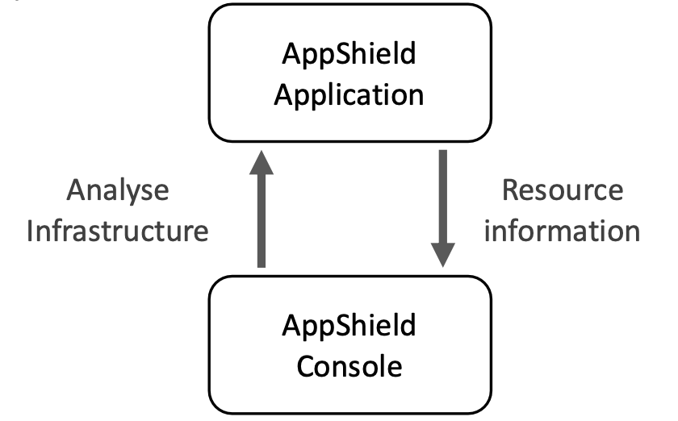
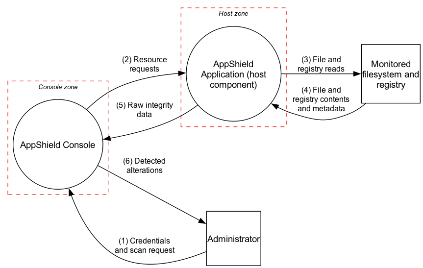

# Level 0: decompose

Shows AppShield in normal network mode as two processes, the external entities they exchange data with, and the trust boundaries between them.

## Starting point: Figure 2 of the brief

The brief says Figure 2 "illustrates the scope and boundaries of the AppShield software system".
It shows two elements, AppShield Console and AppShield Application, and two flows between them.

<figure>

<figcaption>Briefs Level 0 DFD: two elements, two flows, no boundaries drawn.</figcaption>
</figure>

From this diagram we added/changed:

- **"Analyse Infrastructure" renamed to "Resource requests".** "The host software doesn't conduct analysis itself"; the console only asks it for data.

- **Monitored filesystem and registry.** Figure 2's "Resource information" has no source. The host reads it from "files stored in the filesystem" and "registry keys".

- **Administrator.** Nothing in Figure 2 starts a scan or receives its result. "A user can direct the admin console to establish a connection with a host".

- **Trust boundaries.** The brief says Figure 2 shows boundaries, but none are drawn.

Of these, the last three (monitored filesystem and registry, administrator, trust boundaries) are additions, not renames: every flow needs a visible data origin, and a full trust picture needs both endpoints and boundaries drawn, not just the two processes.

<figure>

<figcaption>Level 0 DFD.</figcaption>
</figure>

## Trust boundaries

Drawn as two dashed zones, one around each process. Everything outside them is untrusted by AppShield.

- **Console zone** (flows 1, 2, 5, 6).
  Input from the administrator must be authenticated first (flow 1).
  Traffic to and from the host crosses the network, where anyone on the path can read or write it (flows 2, 5).
  The brief specifies no encryption or authentication for this channel.
- **Host zone** (flows 2, 3, 4, 5).
  The filesystem and registry are untrusted by definition: they're the thing being checked for modification (flows 3, 4).
  The host process runs on that same machine, so if the machine "has been compromised and can no longer be deemed secure", the host process may be too. That's why bootable mode exists.

## Assumptions and scope

- **Credentials on flow 1.** Not stated. Inferred from the console storing "users, credentials, and preferences", which implies a login.
- **Administrator is local to the console.** Flows 1 and 6 stay on the console machine and don't cross the network. The brief doesn't say; a remote console would add network threats to both flows.
- **One host drawn.** Figure 1 shows "a single client can communicate with multiple servers". Each host is identical, so one stands for all.
- **Operating system not drawn separately.** In normal mode the host reads files and keys through Windows; the OS is part of the external entity.
- **Hashes on flow 5, not flow 4.** The host computes MD5/SHA1 from file contents, so flow 4 carries whole contents. This requires read access to every file checked.
- **Console data stores not shown.** The baseline ("locally stored trusted data regarding past resource information") and configuration are internal to the console, not exchanged with anything external.
- **Bootable mode not shown.** Same elements, but both components run from read-only media on the compromised machine and read it directly, "sidestepping the potentially compromised operating system". A different scenario from normal network mode, so out of scope for this diagram.

## OWASP phase 1 lists

Steps 1-5: external dependencies, trust levels, entry points, exit points, and assets, each read directly off the DFD above.
Trust levels come right after external dependencies, ahead of entry points and exit points, because both name trust levels by ID and need them defined first.
Each depth lists only the rows it adds; IDs continue at the next depth.
Elements and flow numbers are the ones drawn in the DFD figure; they aren't repeated here as a separate table.

### External dependencies

Items outside AppShield's code that may pose a threat to it: what each process runs on or relies on.

| ID | Description |
| --- | --- |
| ED1 | Windows Server on each monitored host. The host "operates as a service on a Windows server" and inherits its patch level, service account and file permissions. |
| ED2 | Windows on the console machine. It holds the console's local files ("stores on local files"); protecting them is left to Windows. |
| ED3 | The network between console and host (Figure 1). Protocol, encryption and authentication are not specified. |
| ED4 | MD5 and SHA-1 implementations. "Checksum of data (using MD5 and/or SHA1 hash)". Both have practical collision attacks, so two prepared files with the same hash are possible. |

### Trust levels

The access rights granted to each party: who sits on each side of each trust boundary.

| ID | Name | Description |
| --- | --- | --- |
| TL1 | Network user | Anyone who can send, read or change traffic between console and host. The brief specifies no authentication on that network, so this is anyone who can reach it. |
| TL2 | Console machine user | Anyone who can use the console machine without an AppShield login. |
| TL3 | Administrator | Logged in to the console. Can start scans and see results for every host. Assumes the console has a login (see Assumptions and scope). |
| TL4 | Host service account | The Windows account the host service runs as. Must be able to read every file and key it checks. |
| TL5 | Monitored machine user | Anyone who can change files or registry keys on a monitored machine, including an attacker who has compromised it. |

### Entry points

Where a flow crosses into a trust boundary, bringing data or a request that the zone it enters must then decide whether to trust.

| ID | Name | Flow | Description | Trust levels |
| --- | --- | --- | --- | --- |
| EP1 | Console login and scan request | 1 | The administrator logs in and names the host to scan. | TL2 can reach it; TL3 is needed to get past it |
| EP2 | Host request listener | 2 | The host receives requests for its version and file properties. | TL1: the brief restricts nothing. Intended: TL3, through the console |
| EP3 | Console response handling | 5 | The console receives raw integrity data and parses it. | TL1: any reply arriving over the network. Intended: the host (TL4) |
| EP4 | File and registry data | 4 | The host receives file contents, metadata and registry data from Windows. | TL5: whoever can write the files decides what the host reads |

### Exit points

Where a flow crosses out of a trust boundary, sending data somewhere AppShield no longer controls.

| ID | Name | Flow | Description | Trust levels |
| --- | --- | --- | --- | --- |
| XP1 | Findings to the administrator | 6 | Detected alterations shown to the administrator. | TL3 |
| XP2 | Requests to the host | 2 | Which host and which paths are checked. | Visible to TL1 |
| XP3 | Raw integrity data to the console | 5 | Filenames, sizes, hashes, ACLs and registry data of the monitored machine. | Visible to TL1 |
| XP4 | Reads on the monitored machine | 3 | Which files and keys the host reads, and when. | Visible to TL5 |

EP2/XP2 and EP3/XP3 are the same arrows seen from each end: flow 2 is an exit for the console and an entry for the host, and flow 5 is an exit for the host and an entry for the console.
Whoever can read or tamper with the data as it leaves one boundary is exposed to the same threat as whoever receives it on the other side, so an exit point's threats mirror its matching entry point's rather than adding new ones.

### Assets

What attackers are after: the reason threats exist. Each threat identified later references one of these asset IDs.

| ID | Name | Description | Trust levels |
| --- | --- | --- | --- |
| A1 | Trustworthy findings | The detected alterations (flow 6) and the data behind them (flows 4, 5). If they are wrong, the administrator trusts a machine that has been changed. This is what AppShield exists to protect. | TL3 |
| A2 | Administrator credentials | Carried on flow 1 (assumption). Whoever holds them can scan and read results for every host. | TL3 |
| A3 | Information about monitored machines | Filenames, ACLs, registry data, hashes and the host version (flows 2, 5). A map of each machine and its permissions. | TL3 through the console |
| A4 | Host read access | The host must read every checked file (flow 4). Taking over the host gives that access. | TL4 |
| A5 | Continuous monitoring | Scans run and finish for every host. Changes made while scans fail go unnoticed. Abstract asset. | TL3 |
